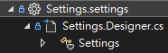

# 那些年，我在C#寫系統遇到的設定檔問題

## The begining: Settings.settings
還記得一開始碰C#，是在我大學的時候，當時開始加入到實驗室的計畫中，一開始接觸到的是setting檔案，當時還覺得很好用，開發時只要改改值就好，在後端就能夠用強型別直接取用。

```csharp
string isDev = Settings.Default.isDev;
```



然而從上面的結構就可以知道，因為包含了`.cs`檔案，所以並非完全的靜態config，一旦要做自動化部屬，沒有辦法拿同一個建置的結果同時放到測試與正式環境(雖然isDev放在環境變數就可以完美解決)。不過當時我並沒有理解這問題，因為我馬上轉為接手當時的系網站，所以接觸到的設定檔理所當然的變成了`web.config`。

## web.config

```xml
<?xml version="1.0" encoding="utf-8"?>
<configuration>
    <configSections>
        <sectionGroup name="applicationSettings" type="System.Configuration.ApplicationSettingsGroup, System, Version=4.0.0.0, Culture=neutral, PublicKeyToken=b77a5c561934e089">
            <section name="WKE.Entity.Settings" type="System.Configuration.ClientSettingsSection, System, Version=4.0.0.0, Culture=neutral, PublicKeyToken=b77a5c561934e089" />
        </sectionGroup>
    </configSections>
    <applicationSettings>
        <WKE.Entity.Settings>
            <setting name="isDev" serializeAs="String">
                <value>T</value>
            </setting>
        </WKE.Entity.Settings>
    </applicationSettings>
</configuration>
```

web.config是xml格式的設定檔案，裡面包含了安裝的套件，以及IIS的諸多設定都會直接寫在裡面，在當時沒有系網站測試機的環境下真的非常痛苦，在沒有清楚交接的情況下，遇到了多不勝數的狀況。

不過也是多虧如此，讓我在這爛攤子中學會很多關於IIS架站的知識，到未來可以輕鬆在筆電內搞出一大堆網站，還同時不影響到公司網路環境，也是多虧此段時間的經歷。

web.config雖然說是完全靜態的網站，但由於跟IIS站台綁定太深，所以常常遇到牽一髮動全身的問題，往往改了一兩個設定檔，卻可能因此導致網站跑不起來。所以有沒有更適合的設定檔呢?完全靜態且跟其他系統沒有強耦合，不會彼此影響?

這時候，以前實驗室專題畢業的學長回來讀碩士，也帶回來了一些更通用的方式 : `appsettings.json`

## appsettings.json

```json
{
    "isDev": "ture"
}
```

雖然以現在角度來說，當時使用appsettings.json的方式像個笨蛋，自己寫了爛爛的function來讀取json檔案，連怎麼使用都不太懂。但json檔案簡單易懂的資料結構還是深得我心，直到實驗室畢業我都很喜歡使用json檔案來記錄設定檔，包含了`網站存活測試`和我寫給自己的各式小工具，當時還有個python小工具是特別處理`appsettings.jon`用的。

就這樣一路到了現在這間公司，技術實力其實相較於實驗室更差，還有很多背景程式還在使用settings檔案以及.net framework的框架，而我早在實驗室就已經開始寫.net core 3了。理所當然，我開始大力推薦`appsettings.json`，但卻遇到資安方面的阻力。

前面只提到json檔案的好處，但卻沒有提及缺點。

這套模式的開發部屬都沒有問題，但問題出在多人合作以及版本控制。試想，git上的紀錄基本上是永久保存的，`isDev`這種不痛不癢的資料上傳到git當然沒問題，但如果是資料庫連線方式呢?

面對機敏資料當然不可能隨意上傳到git上面，事實上在實驗室就曾經有過一次這樣的失誤，不小心把重要的資訊給push到了git上面。也因此，在來到這間公司後我開始著手思考與研究，終於到達現在的最終型態。

## Environment, Key Vault and User Secret

先說，在走到這一步之前，我花費非常多時間學習有關DevOps的觀念，包含CI/CD、金絲雀和藍綠部屬等等，還有其他關於Azure上開發微服務相關的課程。所以相較於前面的進度，算是大幅度的改變。

這個章節一口氣帶入了3個不同設定檔存放的位置，配合appsettings.json，一共有4種設定檔，那麼優先順序該怎樣定?意思是當有同樣的變數存在，我們要相信誰的值?

先說答案:

* Environment > User Secret > appsettings.json

咦?Key Vault呢?

先別急，Key Vault由於是另外的儲存區，所以通常不會跟這3個一起討論。我們可以先好好講這3個設定檔各自的使用情境，怎樣的資料放在環境變數；怎樣的資料放在User Secret；怎樣的資料又放在appsettings.json

### Classify your data

我們先想想一個情境，其條件如下:

1. 我有一個網站，平常在筆電開發只會連到測試DB
2. 正式區連正式DB
3. 測試區連測試DB
4. 有一個特殊的Debug機器，我可以在上面連正式DB
5. 正式區不允許跑Debug (沒有IDE)
6. CD時會先部屬到測試區，經驗證才到正式區，且兩個區域的程式碼要相同

在一個有點規模的資安條件下，這是很正常的情況，正式和測試區徹底分開，僅提供少部分機器可以直連正式的資料庫。

那麼在這樣的情況下，該怎樣做?

#### 1. isDev

其實很簡單，首先`isDev`這種會影響到程式碼運作環境的變數，直接跟環境綁死既可。
在測試機和正式機環境都會有`isDev = true`的環境變數，這樣就達到同一份程式碼放在不同環境下就會去連線不同的資料庫。

而同時`isDev`並非機敏資料，為了開發方便可以直接寫在appsettings.json中 : `{ "isDev": "true" }`

如果今天有特殊狀況要處理，要連正式資料庫做debug，我們可以直接到那台跳板機上修改appsettings.json : `{ "isDev": "false" }`，但要注意此時任何修改都不可以push到git上面，不然就有可能導致機敏資料洩漏。

#### 2. API Key

然而重要的機敏資料需要嚴格保護，此時就可以直接存放在環境變數中即可，正式機儲存正式的API Key；測試機儲存測試的API Key。

在筆電上開發時，由於環境可能更為複雜，不適合直接更改環境變數，因此反而推薦使用User-Secrets來待替。

相關文件可以看[微軟的Document](https://learn.microsoft.com/zh-tw/aspnet/core/security/app-secrets?view=aspnetcore-10.0&tabs=windows)

#### 3. 其他非機敏資訊

這就沒什麼好說的了，可以直接存在appsettings.json中就好，管理方便修改也簡單。

### Key Vault

Key Vault的定位會是保存機敏資訊的那一邊，可以想像成環境變數的上位版本，使用Key Vault保存機敏資訊一定是更安全的作法。不過考慮到成本以及連Key Vault也會需要有連線資訊，例如Client ID, Client Secret或是使用憑證等等，基本上還是會需要保存這類型的機敏資料在環境變數當中(憑證通常就直接匯入機器裡面)，我認為在這點是和環境變數有所衝突的，所以大多數情況下我可能更偏向直接將資料存在環境變數當中。

所以在我看來，除非你的資安等級夭壽高或是打算上雲，否則使用雲端Key Vault就只是花錢找麻煩，還不如直接存在環境變數來得簡單。當然，如果有本事建立地端的Key Vault就是另外一回事了，有這種程度應該也不用看我這篇文章浪費時間。
