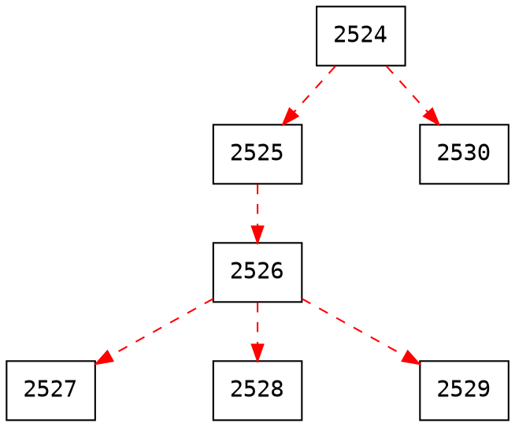

# EX4 : C Fork Tree

###### tags: `Note`

紀錄一下大學時修Unix Programing這堂課的程式碼

## Fork Sample

```cpp=
#include <stdio.h>
#include <unistd.h>

int main() {
  pid_t pid;

  // 建立子行程
  pid = fork();

  if (pid == 0) {
    // 子行程
    printf("I'm %d, Child process!n", getpid());
  } else if (pid > 0) {
    // 父行程
    printf("I'm %d, Parent process!n", getpid());
  } else {
    // 錯誤
    printf("Error!n");
  }
  return 0;
}
```

### Simple Fork Tree (Left Version)

如果今天想要透過Fork來長一棵樹，讓輸出如以下，根據文字輸出可以畫成如圖中所示。

`wait(null)`這個用法是為了保證順序，讓樹的順序正常，其語法真正意義是讓parents等待children發出signal(當程式結束就會自動發出signal)，而當wait回傳-1時，則代表所有childre都結束了。


```
$./a.out 2 1 3
I'm 2527, my parent is 2526
I'm 2528, my parent is 2526
I'm 2529, my parent is 2526
I'm 2526, my parent is 2525
I'm 2525, my parent is 2524
I'm 2530, my parent is 2524
I'm 2524, my parent is 1567
```



在編寫這段程式碼時，其設計概念如下：
1. 根據輸入輸出判斷，數字是用來代表每一代有多少children
2. 只有最左邊的process，有資格生產下一代

根據以上條件，可以大概構思流程如下，至於每一代要怎樣生小孩先不用管：
1. 抓取輸入，搞清楚有幾代人(argc)
2. for loop一代一代去生小孩

程式碼寫出來會像下面這樣
```cpp=
#include <errno.h>
#include <stdio.h>
#include <stdlib.h>
#include <unistd.h>
#include <sys/wait.h>

void main(int argc, char *argv[]) {
    if(argc > 1){
        int Flag = 1;
        for(int i=1;i<argc;i++){
            // get the input from argv
            int the_input = atoi(argv[i]); // how many childrem will born
            printf("%d\n", the_input);
            // replace this line to fork children
        }
    }
    printf("I'm %d, my parent is %d\n", getpid(), getppid());
}
```

接下來，就要開始設計最難的生小孩機制了，先來個毫無限制的版本，模仿最一開始的範例來做
```cpp=
for(int j=0;j<the_input;j++){
    pid_t pid;
    pid = fork();
    if (pid == 0) printf("I'm %d, Child process!n", getpid());
    else (pid > 0) printf("I'm %d, Parent process!n", getpid());
}
```

1. 剛出生的小孩可不會生小孩，所以剛出生的小孩要等到下一代再來

```cpp=
for(int j=0;j<the_input;j++){
    pid_t pid;
    pid = fork();
    if (pid == 0){
        printf("I'm %d, Child process!n", getpid());
        break;
    }
    else (pid > 0) printf("I'm %d, Parent process!n", getpid());
}
```

2. 由於是跑for loop，因此當我這代要生小孩時，我的parents也會參與進來，也會接收到這代要生幾個小孩，這是我們不想要的，因此首先要排除parents生grant children的狀況(`i = argc`)
```cpp=
for(int j=0;j<the_input;j++){
    pid_t pid;
    pid = fork();
    if (pid == 0){
        printf("I'm %d, Child process!n", getpid());
        break;
    }
    else (pid > 0){
        printf("I'm %d, Parent process!n", getpid());
        i = argc;
    }
}
```
3. 我這代在生小孩時，希望只有老大(最左邊)可以生，因此會需要上一代人保留紀錄，告訴我誰可以生小孩(想像成雙胞胎，你的父母或上一代人不告知的情況下怎麼可能知道誰是老大?)。
```cpp=
int isTheFirst = 1;
if(isTheFirst){
    for(int j=0;j<the_input;j++){
        pid_t pid;
        pid = fork();
        if (pid == 0){
            printf("I'm %d, Child process!n", getpid());
            break;
        }
        else (pid > 0){
            printf("I'm %d, Parent process!n", getpid());
            i = argc;
        }
    }
}
```

5. 接下來就要紀錄誰是老大了，但問題是j是在for loop內宣告的，break後根本沒有辦法找到原本的j，因此要把j的宣告位置移到for loop外，然後在children break之後判斷。
```cpp=
int isTheFirst = 1;
int j=0;
if(isTheFirst){
    for(;j<the_input;j++){
        pid_t pid;
        pid = fork();
        if (pid == 0){
            printf("I'm %d, Child process!n", getpid());
            break;
        }
        else (pid > 0){
            printf("I'm %d, Parent process!n", getpid());
            i = argc;
        }
    }
    if(j==0) isTheFirst = 1;
}
```

6. 到這裡，Fork Tree的部分就差不多結束了，將code整理一下，並加上wait(null)，控制每個process生小孩的順序後，完整程式碼如下：
```cpp=
#include <errno.h>
#include <stdio.h>
#include <stdlib.h>
#include <unistd.h>
#include <sys/wait.h>

void main(int argc, char *argv[]) {
    if(argc > 1){
        int Flag = 1;
        for(int i=1;i<argc;i++){
            // get the input from argv
            int the_input = atoi(argv[i]);
            int j=0;
            pid_t cid;


            // start to make fork tree
            if(Flag){
                Flag = 0;
                for(;j<the_input;j++){
                    cid = fork();
                    if(cid == 0) break;
                    else {
                        i = argc;// let parent don't fork grant child
                        wait(NULL); // wait children
                    }
                }
            }
            if(j==0) Flag = 1; // setting the left leaf flag
        }
    }
    while(wait(NULL)!=-1); // wait children
    printf("I'm %d, my parent is %d\n", getpid(), getppid());
}
```