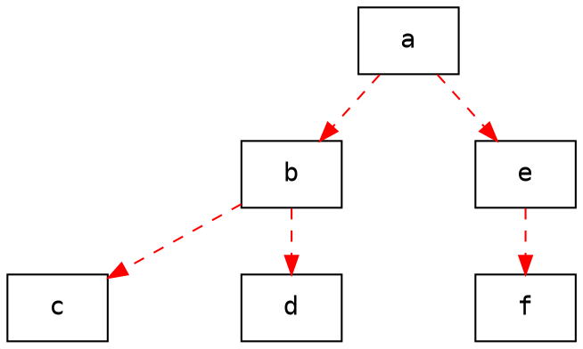

#  EX7 : Create Pipe between Fork Tree

###### tags: `Note`

[題目出處:Klim的網站](http://erdos.csie.ncnu.edu.tw/~klim/unix-p/usp-1072.html)

紀錄一下大學時修Unix Programing這堂課的程式碼

## 題目
Refer to the description of exercise 2 (usp-982) for explanation of code .
Use the code shown above to build a process tree, but between a parent and each one of its children you have to create two pipes. One pipe is for parent's sending to child, the other is for child's sending to the parent.
After created, each process will do something as follows.
      
      loop
        if root then  ch = get a char from stdin
                else  ch = get a char from parent
      
        if ch==label then ch=POST
        for each child  do
          send ch to child
          get ack from child 
        if ch==POST then
           show this process's info

        if not root then send ack to parent
        if ch='q' then break
      forever
      
* For example:

      $ ./a.out ddduduudduuu abcdef
      I'm a, my pid=1, and my ppid=813
      I'm e, my pid=1, and my ppid=1636
      I'm b, my pid=1, and my ppid=1636
      I'm f, my pid=1, and my ppid=1638
      I'm d, my pid=1, and my ppid=1637
      I'm c, my pid=1, and my ppid=1637
      a
      I'm c, my pid=1640, and my ppid=1637
      I'm d, my pid=1641, and my ppid=1637
      I'm b, my pid=1637, and my ppid=1636
      I'm f, my pid=1639, and my ppid=1638
      I'm e, my pid=1638, and my ppid=1636
      I'm a, my pid=1636, and my ppid=813
      b
      I'm c, my pid=1640, and my ppid=1637
      I'm d, my pid=1641, and my ppid=1637
      I'm b, my pid=1637, and my ppid=1636
      e
      I'm f, my pid=1639, and my ppid=1638
      I'm e, my pid=1638, and my ppid=1636
      q
      $ 

* The sample code wil build a fork tree as bellow.



#### sample code(exercise 2 (usp-982))
```cpp=
#include <errno.h>
#include <stdio.h>
#include <stdlib.h>
#include <unistd.h>
#include <string.h>
#include <sys/wait.h>

int get_treesize(char *s) {
    int i, level;

    for(level=0, i=0; s[i]; i++){
        if(s[i] == 'd') level += 1;
        if(s[i] == 'u') level -= 1;
        if(level == 0) return i+1;
    }

    return i;
}

void main(int argc, char *argv[]){
    char label, *labels, *t_begin, *t_end;
    int  j;

    t_begin = argv[1]; 
    t_end   = t_begin + strlen(t_begin) - 1;
    labels  = argv[2];

newborn:
    label = *labels;  labels += 1;

    t_begin = t_begin + 1;
    while(t_begin < t_end ) {
        j = get_treesize(t_begin);

        if( fork() == 0 ){
            t_end  = t_begin + j - 1;
            goto newborn;
        } else {
            wait(NULL);
            t_begin += j;
            labels += j/2;
        }
    }
  
    fprintf(stderr, "I'm %c, my pid=%d, and my ppid=%d\n", label, getpid(), getppid());
}
```


## How to program it
We can know somthing in the hint :

1. There are two pipe between every two process.
2. One pipe is from root to child, with one write and several read
3. The other pipe is from leaf to root, with several write and one read

### First Step : Stop the fork tree and Who is root ?
We need to stop the process after it was builded. So add some code after the `fprintf`, let leaf pause and node wait.

```cpp=34
cid = fork();
if( cid == 0 ){
    t_end  = t_begin + j - 1;
    goto newborn;
} else {
    // wait(NULL); // delete this line, then process won't stop building tree
    t_begin += j;
    labels += j/2;
}
    
```

```cpp=45
fprintf(stderr, "I'm %c, my pid=%d, and my ppid=%d\n", label, getpid(), getppid());

if(cid == 0) puse(); // cid == 0 => leaf
else while(wait(NULL) != -1); // cid != 0 => node
```
* The the code will run as bellow


Now the process can stop after beening builded, we need to know which process is root.

Add a parameter with default 0 to record generation, every generation will add one time. And the root will be the 0 generation.
```cpp=35
    if( fork() == 0 ){
        generation++;
        t_end  = t_begin + j - 1;
        goto newborn;
    } else {
        wait(NULL);
        t_begin += j;
        labels += j/2;
    }
}
if(generation == 0) printf("I'm %c, I'm root\n", label);
fprintf(stderr, "I'm %c, my pid=%d, and my ppid=%d\n", label, getpid(), getppid());
if(cid ==0) pause();
else while(wait(NULL)!=-1);
```
The result is : 


### Second Step : Add login from the hint pseudo code to break all process

It's very trouble to kill all process after every test. So we will add the pipe from root to leaf to break process first, then program the ack and POST

First, add code logic without real action(print out first).
```cpp=45
fprintf(stderr, "I'm %c, my pid=%d, and my ppid=%d\n", label, getpid(), getppid());
while(1){
    if(generation == 0) printf("I'm root, I will get ch from stdin\n"); // mark it, replace with right code latter
    else printf("I'm node or leaf, I will get ch from parent"); // mark it, replace with right code latter

    if(ch[0] == 'q') break;

    // leave from the while loop
    if(cid == 0) pause();
    else if(wait(NULL) == -1) break;
}
```
The result is : 


* Now we can add the pipe between every process.

We need several write side to child and one read site from parent

1. assume max number of children is 10
2. create pip before fork
3. child close the write side of pipe
4. parent store write side of pipe into array and close the read side

```cpp=27
int children[10]; // for parent to record children
int parent_pipe[1]; // for child to record parent
.
.
.
    if( cid == 0 ){
        close(fd[1]); // child close write site to parent
        parent_pipe[0] = fd[0]; // child record parent's read site of pipe

        generation++;
        t_end  = t_begin + j - 1;
        goto newborn;
    } else {
        close(fd[0]); // parent close read site of child
        children[children_counts++] = fd[1]; // parent record child's write side

        // wait(NULL);
        t_begin += j;
        labels += j/2;
        }
}
fprintf(stderr, "I'm %c, my pid=%d, and my ppid=%d\n", label, getpid(), getppid());
while(1){
    if(generation == 0) fgets(ch, 80, stdin); // root read from stdin()
    else read(parent_pipe[0], ch, sizeof(ch)); // node and leaf read from parent

    for(int i=0;i<children_counts;i++){
        write(children[i], ch, sizeof(ch)); // write to all children
    }

    if(ch[0] == 'q'){ // if ch == 'q' then break from while loop
        close(parent_pipe[0]);
        for(int i=0;i<children_counts;i++){
            close(children[i]);
            wait(NULL);
        }
        break;
    }
}
```
The result is : 


### Third Step : Add children write to parent
Now, we know how to make a one way pipe from root to leaf. Next step is do it again with another way from leaf to root.

1. create pip before fork
2. child close the read side of pipe and record it
3. parent store read side of pipe into array and close the write side

Finally, the code will like bellow : 
#### Answer
```cpp=
#include <errno.h>
#include <stdio.h>
#include <stdlib.h>
#include <unistd.h>
#include <string.h>
#include <sys/wait.h>

int get_treesize(char *s) {
    int i, level;

    for(level=0, i=0; s[i]; i++){
        if(s[i] == 'd') level += 1;
        if(s[i] == 'u') level -= 1;
        if(level == 0) return i+1;
    }

    return i;
}

void main(int argc, char *argv[]){
    char label, *labels, *t_begin, *t_end;
    int j;
    
    /*
    *  fd1 : for parent to send message to child
    *  fd2 : for child to send ack to parent
    *  children : parent to record children
    *  parent_pipe : [0] to read from parent;  [1] to write to parent
    *  generate : record the generate(can judge is root)
    */
    int fd1[2], fd2[2], children[10][2], parent_pipe[2];
    int generate=0, children_counts=0;

    t_begin = argv[1]; 
    t_end   = t_begin + strlen(t_begin) - 1;
    labels  = argv[2];

newborn:
    children_counts = 0;
    label = *labels;  labels += 1;

    t_begin = t_begin + 1;
    while(t_begin < t_end ) {
        j = get_treesize(t_begin);
        pipe(fd1);
        pipe(fd2);
        if( fork() == 0 ){
            t_end  = t_begin + j - 1;
            generate++;
            parent_pipe[0] = fd1[0];
            parent_pipe[1] = fd2[1];
            close(fd1[1]);
            close(fd2[0]);
            goto newborn;
        }
        else {
            children[children_counts][1] = fd1[1];
            children[children_counts][0] = fd2[0];
            close(fd1[0]); 
            close(fd2[1]);
            children_counts++;
            t_begin += j;
            labels += j/2;
        }
    }

    pid_t pid = getpid(), ppid = getppid();
    fprintf(stderr, "I'm %c, the %d generate, my pid=%ld, and my ppid=%ld\n", label, generate, pid, ppid);

    char ch[80], ack[80];
    while(1){
        if(generate == 0) fgets(ch, 80, stdin);
        else read(parent_pipe[0], ch, sizeof(ch));

        if(ch[0] == label) strcpy(ch, "POST\0");

        for(int i=0;i<children_counts;i++){
            write(children[i][1], ch, sizeof(ch));
            read(children[i][0], ack, sizeof(ack));
        }

        if(strcmp(ch, "POST") == 0){
            fprintf(stderr, "I'm %c, the %d generate, my pid=%ld, and my ppid=%ld\n", label, generate, pid, ppid);
        }

        if(generate > 0) write(parent_pipe[1], "ack", 3);

        if(ch[0] == 'q'){
            close(parent_pipe[0]);
            close(parent_pipe[1]);
            for(int i=0;i<children_counts;i++){
                close(children[i][0]);
                close(children[i][1]);
                wait(NULL);
            }
            break;
        }
    }
}
```


